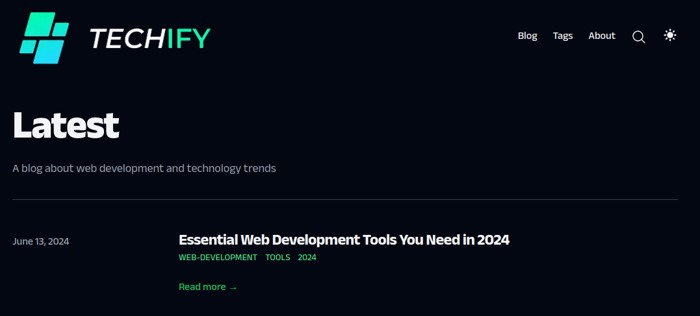

# Welcome to Techify Blog!

## Overview
This project is a personal blog developed by Armando Cesar Martin Calderon. It features various articles and posts related to technology and other interests.

## Blog URL
Visit the blog at [techify.com](https://techify.com)

## Contact
For inquiries or to contribute a post, please contact Armando via email at armandoc9943@gmail.com.

## Preview


## About This Repository
This repository contains the codebase for the blog. It includes frontend assets, server-side logic, and configurations necessary to run the application.

## Setup Instructions
1. **Clone the repository**
   ```bash
   git clone https://github.com/Mandy9943/techify
   cd techify
   ```

2. **Install dependencies**
   ```bash
   npm install
   ```

3. **Run the application**
   ```bash
   npm start
   ```
   The blog should now be accessible at `http://localhost:3000`.

## Technologies Used
- Frontend: HTML, CSS, JavaScript, mdx, Typescripts
- Backend: Node.js, Nextjs


## Contributing
Contributions are welcome! If you'd like to contribute to the blog (e.g., fixing bugs, adding features), please follow these steps:
1. Fork the repository
2. Create your feature branch (`git checkout -b feature/YourFeature`)
3. Commit your changes (`git commit -am 'Add some feature'`)
4. Push to the branch (`git push origin feature/YourFeature`)
5. Open a pull request

Please ensure your code adheres to the existing code style and includes appropriate tests.